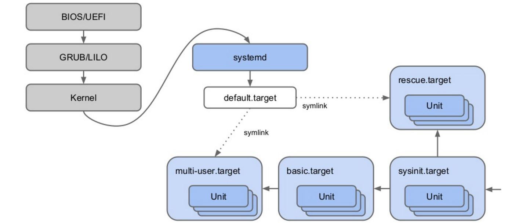

# Linux

## Pseudo File System
Directories created in memory and mounted after boot sequence.

### /proc
Contains information about processes. One directory per process/PID.

`cat /proc/1/cmdline` shows the command that started the process

### /sys
Information about the systems hardware and kernel modules.

### /dev
Lists every device represented as a file. Data from devices can be read with file operations. Every data written to a file will be redirected to the device. 

`echo test > /dev/stdout` redirects to stdout

## Kernel Utilities
`uname` Displays information about the kernel

`lsmod` Displays all loaded kernel modules

`modinfo ${moduleName}` Displays info about a kernel module

`modprobe` Load and unload modules dynamically

## Devices
`lspci` Information about attached PCI devices

`lsusb` Information about USB devices

`lscpu` Information about the processor

`lsblk` Information about block devices

## Boot Sequence

### init
`/sbin/init` First process that initializes the system. Init calls bash scripts in serial, on after another.

### systemd
Replacement for init process that is used be the most Linux distributions nowadays. Starts process in parallel. It can also listen to events e.g. if new hardware gets attached. Systemd has instructions for each daemon that it starts in a text file, so called unit files.

`/usr/lib/systemd/system` Unit file location provided by package installation

`/etc/systemd/system` Unit file location for admins

`systemctl start nginx.service` start a service

`systemctl stop nginx.service` stop a service

`systemctl status nginx.service` show status for a service

`systemctl restart nginx.service` restart a service

`systemctl reload nginx.service` reload the service without interrupting normal functionality

`systemctl disable nginx.service` Disable the service to not start automatically at boot time

`systemctl enable nginx.service` Enable the service to start automatically at boot time

`systemctl list-unit --all` Display units. With --all flas, also the inactive units are displayed

`systemctl list-unit-files` Display all unit files.

`systemctl list-unit-files -t target` Display all unit files of a certain type. E.g target, service, mount, device ...

`systemctl cat nginx.service` Display content of a unit file

`journalctl -b` Display system log messages from the kernel and applications. The -b flag limits the output to the current boot.

`journalctl -k -b` Display only the kernel logs. Same as `dmesg`

`journalctl -u nginx.service` Display logs for a unit

### Runlevels
Classic init system:

0. halt
1. single user mode
2. multi-user mode without networking
3. multi-user mode with networking
4. reserved for custom environment
5. multi-user with network and graphic desktop
6. reboot

`runlevel` shows the actual run level you are in

`init 3` change to run level 3

Systemd replaced run levels with targets:

* multi-user.target - similar to runlevel 3
* graphical.target - multi-user with desktop
* rescue.target - rescue shell with basic systems and mounted file system
* basic.target - used during the boot process, first target before other target takes over
* sysint.target - system initialization
* man 5 systemd.target - defines the target unit configuration
* man 7 systemd.special - listing of all target units and definitions

`systemctl list-unit -t target` displays all targets

`systemctl get-default` shows the actual target of systemd

`systemctl set-default graphical.target` change default target

## Shutdown and Reboot
`init 6` reboot the system, same as `reboot` or `shutdown -r now`

`shutdown -h 1 minute` shutdown the system in one minute

`systemctl reboot.target` reboot the system

`systemctl shutdown.target` shutdown the system

`wall` send messages to other users, enter text and send with ctrl+d

